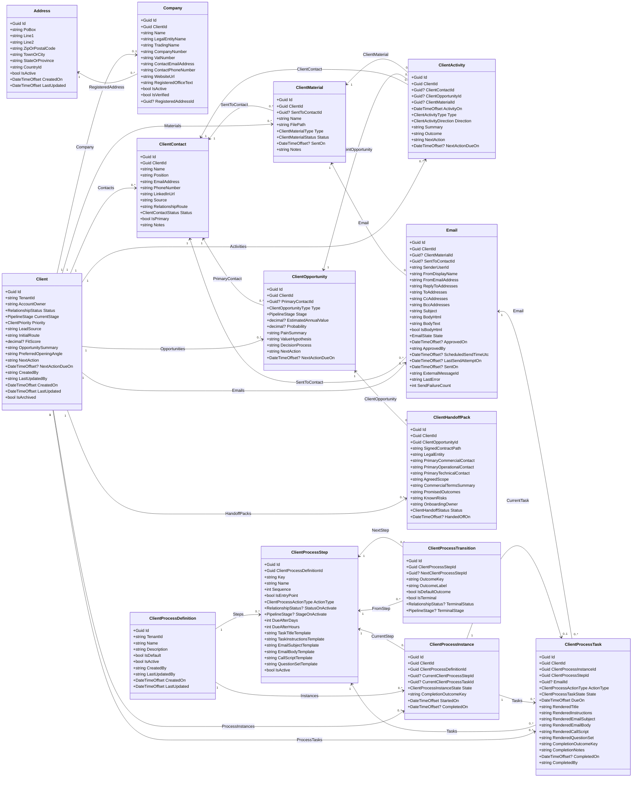

# Entity Class Diagram

This diagram reflects the current classes in `Models/Entities` and the relationships expressed by their foreign keys and navigation properties.

## Reading Notes

- `Client` is currently the main aggregate root around which most of the model hangs.
- `Company` is effectively a one-to-one extension of `Client`.
- `ClientOpportunity` is a child collection under `Client`, not a separate aggregate root.
- `ClientActivity`, `ClientMaterial`, and `Email` together form most of the communication and collateral history.
- The newer process automation layer sits alongside the core relationship model:
  - `ClientProcessDefinition` -> `ClientProcessStep` -> `ClientProcessTransition`
  - `ClientProcessInstance` and `ClientProcessTask` attach that process to a `Client`
- `ClientProcessTask` can optionally point at an `Email`, which is how scheduled process-driven outreach is currently connected into the email workflow.
